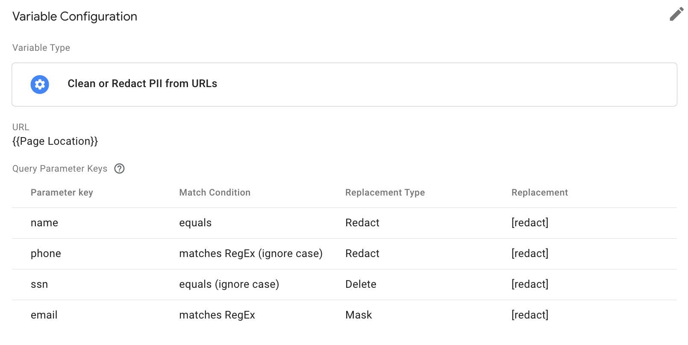

# GTM 'Clean or Redact PII from URLs' Server Variable Template

  

---

## Summary

This repository contains a [Google Tag Manager Server Variable template](https://developers.google.com/tag-manager/templates) that makes it possible to clean up URLs to remove any personally identifiable information (PII) before sending them to analytics or third-party platforms.

## Options

### URL
A URL from event data **{{ED - Page Location}}** (event_data.page_location).

### Query Parameter Keys
List the query parameter keys to redact, delete or mask. You can use different matching condition options.

### Query Parameter Values
Query parameter values with dynamic or unknown keys can be redacted if the value matches a specified regular expression.

## Examples

## Tips
Make sure to default the `false` value to the initial input, in case any error happens during the replacement of the URL.

## Contributing
See our [contributing guidelines](CONTRIBUTING.md).
